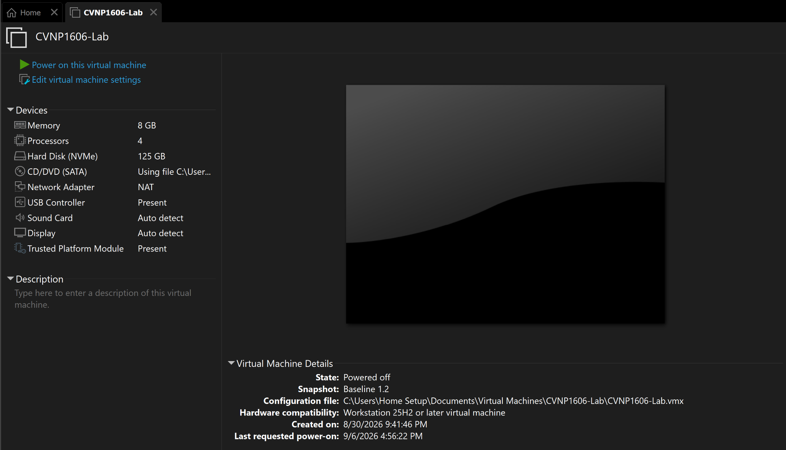
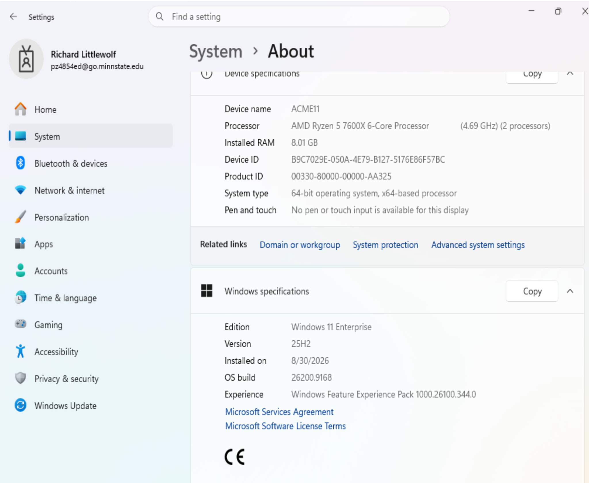

# Week 1 - Windows 11 Build and Baseline

## Overview

For Week 1, I created and documented a Windows 11 virtual machine that will be used for future labs. I checked the VM hardware, Windows version, user accounts, Windows updates, system inventory, TPM, and created a clean baseline snapshot.

## VM Hardware

I configured the virtual machine in VMware Workstation with:

- 8 GB RAM
- 4 processors
- 125 GB virtual hard drive
- Trusted Platform Module (TPM)
- Windows 11 Enterprise

### Evidence

## Windows 11 System Information

I verified the Windows version and system information by going to:

**Settings > System > About**

The VM is running Windows 11 Enterprise version 25H2. The device name is ACME11 and the VM has 8 GB of RAM.

### Evidence

